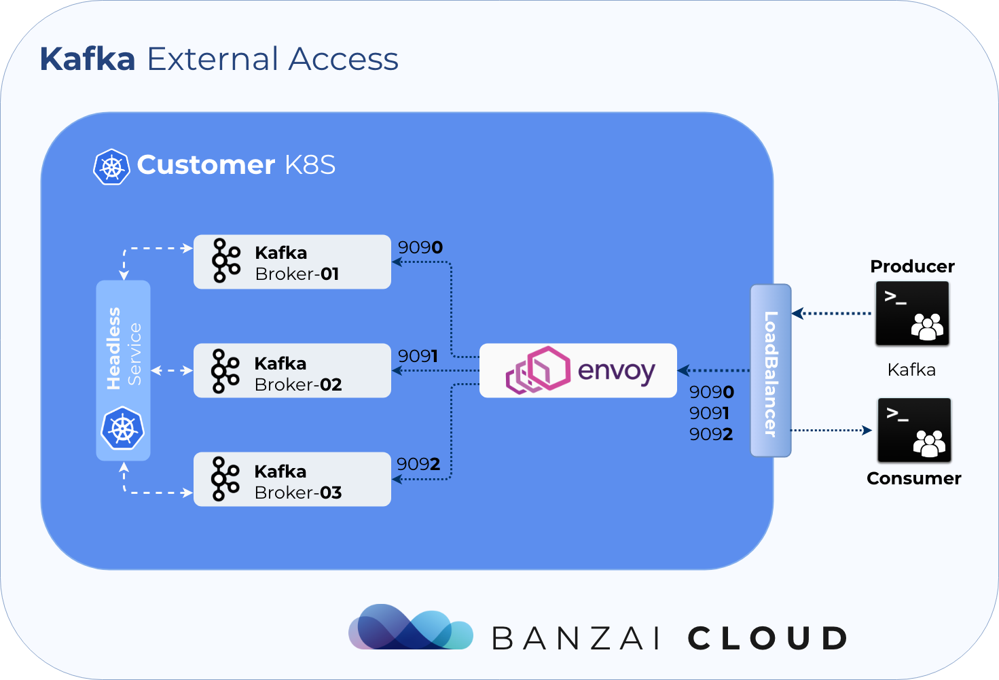
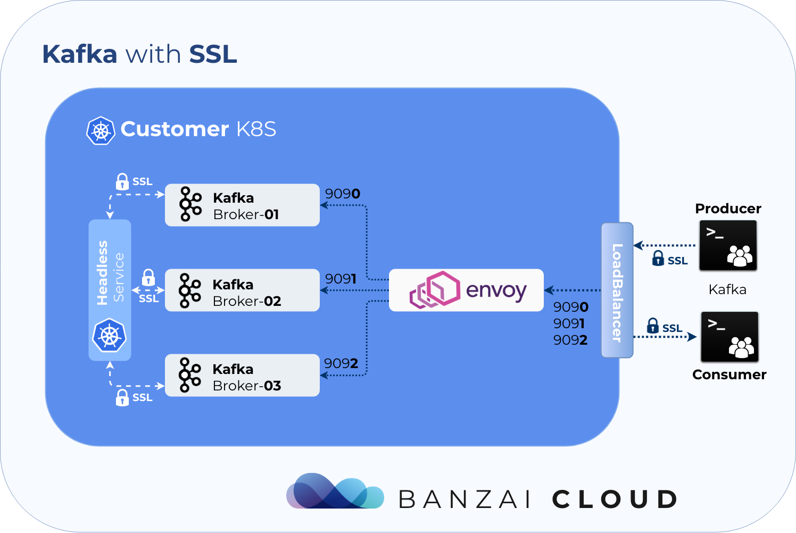

# Features

Some of the features of the Kafka operator and the design decisions are:

#### Fine Grained Broker Config Support

Kafka is a stateful application.  The smallest brick in the puzzle is the Broker which is a simple server capable to create/form a cluster with other Brokers. Every Broker has his own **unique** configuration which slightly differs from the others eg.: *unique broker ID*.

All Kafka on Kubernetes operators we are aware of are using **StatefulSet** to create a Kafka Cluster.

With StatefulSet we get:
- Unique Broker ID generated during Pod startup
- Networking between brokers with headless services
- Unique Persistent Volume for Brokers

Using StatefulSet we loose:
- Ability to modify the configuration of a unique Broker
- Remove a specific Broker from cluster (StatefulSet always removes the last)
- Using multiple and different Persistent Volumes per Broker

The Banzai Cloud Kafka Operator is using only `simple` Pods, ConfigMaps, and PersistentVolumeClaims instead of StatefulSet.
Using these resources (other then StatefulSet) allows us to build an Operator which serves better Kafka.

With the Banzai Cloud Kafka operator we can:
- Modify the configuration of a unique Broker
- Remove a specific Broker from the cluster
- Use multiple Persistent Volumes per Broker

This also means that reacting to events is possible in a fine grained way, per Broker and we are not limited to how StatefulSet works (which e.g. removes the last Broker). The solutions out there try to overcome some of these issues by placing scripts inside the container to generate the config at runtime, whereas with the Banzai Cloud Kafka operator configurations are deterministic and placed in specific ConfigMaps. 

#### Graceful Kafka Cluster Scaling

Here at Banzai Cloud we know how to operate Kafka at scale (we are contributors and have been operating Kafka on Kubernetes for years now) however we believe that LinkedIn has way more experience than us. To gracefully scale (up and down) Kafka clusters we integrated LinkedIn's [Cruise-Control](https://github.com/linkedin/cruise-control) to do the hard work. We have good defaults (plugins) to react to events, however we allow users to write their own.

#### External Access via LoadBalancer

The Banzai Cloud Kafka operator is externalizing the access to Kafka using a dynamically (re)configured Envoy proxy. Using Envoy allows us using **only one** LoadBalancer, no need a LB per Broker.

#### Communication via SSL

The operator fully automates Kafka's SSL support. Users must provide and install the right certificate as a Kubernetes Secret, however the Pipeline platform can automate this as well. 

#### Monitoring via Prometheus

The Kafka operator exposes Cruise-Control and Kafka JMX metrics to Prometheus.

#### Reacting on Alerts

The Kafka Operator acts as a **Prometheus Alert Manager**. It receives alerts defined in Prometheus, and create actions based on Prometheus alert annotations.

Currently there are 3 actions defined by default (can be extended):
- upscale cluster (add new Broker)
- downscale cluster (remove Broker)
- add additional disk to a Broker

For a further list of scenarios, please follow this [link](scenarios.md).
